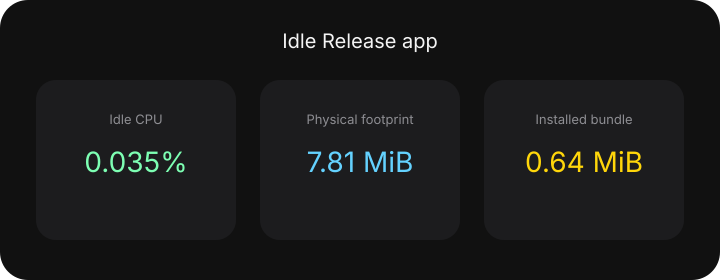

<p align="center">
  
</p>

<h1 align="center">Monitor Volume</h1>

<p align="center">Route macOS volume keys to the external monitor selected as the default audio output.</p>

## What it is and how it works

Monitor Volume is a Swift 6.2 SwiftPM accessory app for macOS 15 and later. It has a C transport shim, a core library, and an executable. It is an `LSUIElement` app: no Dock icon and no menu bar item. Feedback is a non-activating SwiftUI HUD.

A CoreGraphics event tap intercepts Volume Up, Volume Down, and Mute. That tap requires the Accessibility grant. Volume and mute travel as DDC/CI over I2C through the private `IOAVService` entry points, resolved at runtime with `dlopen`. The macOS default audio output is resolved to exactly one framebuffer. Eligibility is fail-closed: if the destination is missing, ambiguous, or not a controllable external monitor, the keys stay with macOS.

Those private entry points have no Apple contract. The default-output binding is recorded in [ADR 0001](docs/adr/0001-follow-default-monitor-audio-output.md). The app-owned HUD, rather than the private Tahoe OSD, is recorded in [ADR 0002](docs/adr/0002-replace-native-volume-osd-on-macos-tahoe.md).

## Performance

Idle measurements of the installed Release app on Mac14,9, macOS 26.5 build 25F71, arm64. Physical footprint is the quantity Activity Monitor displays, not RSS.

<p align="center">
  
</p>

The numbers come from `make profile`. They are not a historical HUD record.

## Build

```bash
make build
```

The Makefile builds, signs, installs, and launches `Monitor Volume` in `~/Applications`.

## Profiling

```bash
make profile
```

The command measures the installed Release app at idle: CPU percent after discarding the unpaired first sample, physical footprint, and installed bundle size. It refuses to measure when the installed app is not the live process. It writes `docs/performance/idle-baseline.json` and regenerates the chart above. A missing baseline fails the renderer; it never substitutes a value.
